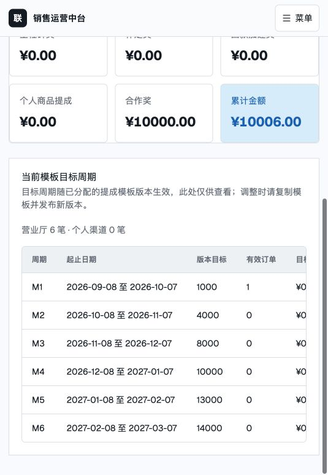
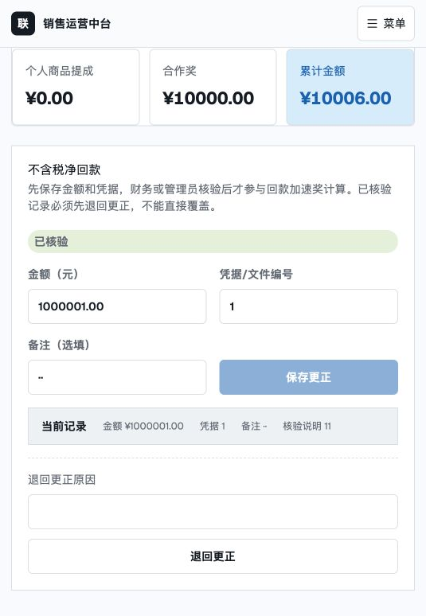
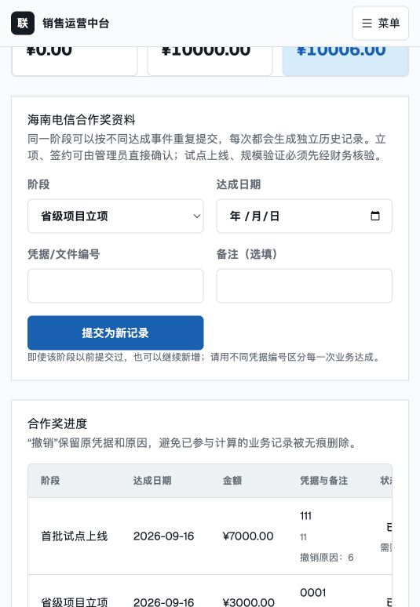
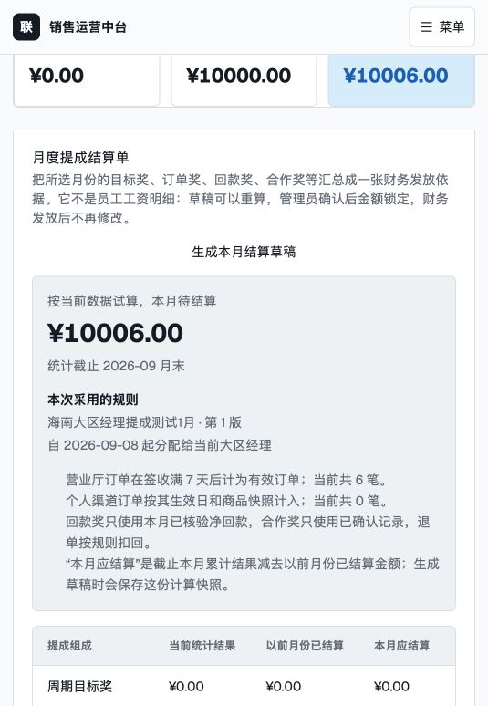
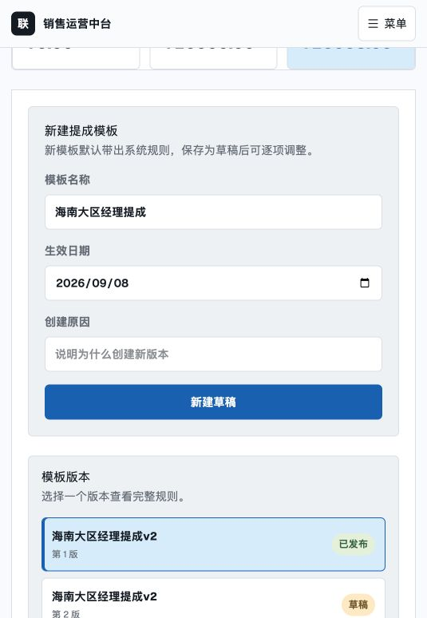
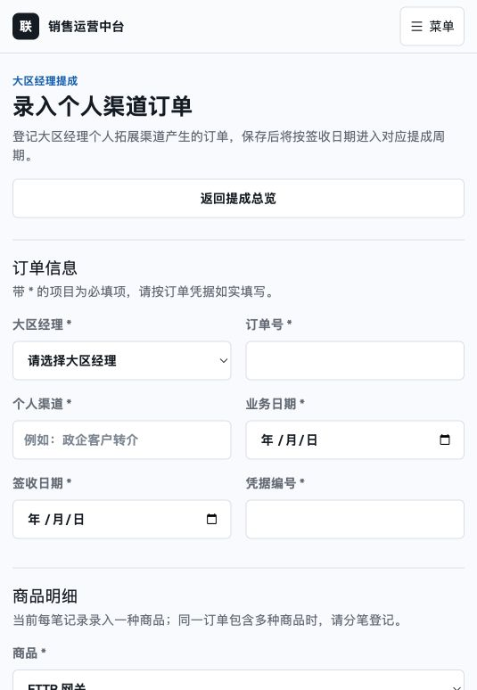
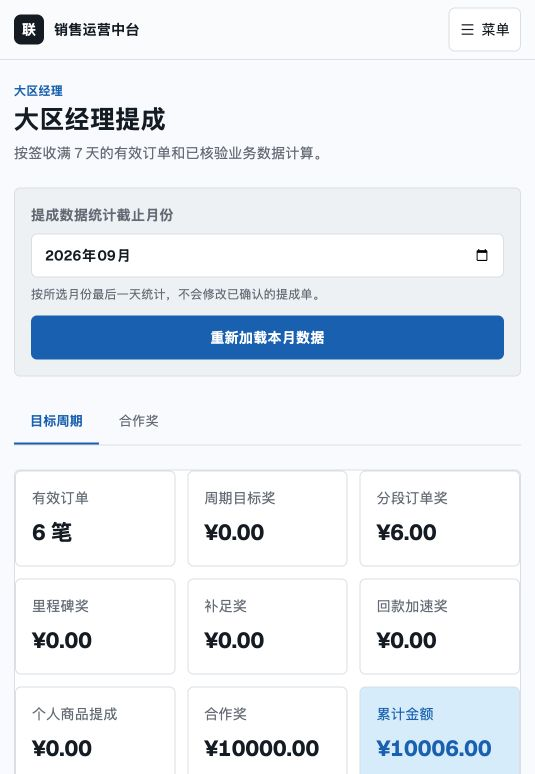

# 大区经理提成界面与规则文档一致性核查

核查日期：2026-09-08  
规则基准：`docs/大区经理提成规则与实施设计.md`  
核查范围：管理员/HR/财务工作台、大区经理本人页面、目标计划、模板分配、回款、合作奖、个人渠道订单、月度结算及其服务端计算路径。

## 总体结论

当前版本可用于演示基本录入和模板流程，但还不能按该 MD 作为正式提成结算依据。最严重的问题不是页面文案，而是目标周期来源、合作奖重复计发、负回款、历史快照和工资发放账本没有完全按文档实现。

## 页面流程与健康度

### 1. 目标周期 — 严重偏差

- 页面把模板分配日 2026-09-08 当成 M1 开始日；文档要求目标计划独立保存，首个计划默认从入职日开始。
- 当前代码根据模板里的 `targetCycle` 动态生成周期，没有读取已经存在的目标计划与周期表。
- 结算单写入时 `targetPlanId` 为 `null`，无法证明当时采用了哪个目标计划。

### 2. 回款核验 — 部分符合，但结果解释不足

- 当前数据有 6 笔有效订单，模板的回款加速奖解锁门槛为 50,000 笔，所以即使 2026-09 已核验净回款为 1,000,001 元，奖励仍为 0；计算结果本身符合当前规则。
- 页面没有显示“6 / 50,000、未解锁、0.05%、月上限 30,000 元”，用户无法判断为什么是 0。
- 前后端禁止负数净回款，但文档规定跨月退款可以让当月净回款为负数，奖励按 0 计算。
- 更正会覆盖同月记录，缺少完整前值/后值和版本化审计展示。

### 3. 合作奖 — 严重偏差

- 当前页面明确允许同一阶段重复提交并重复计入；文档要求“每个阶段只能计发一次，四阶段合计最高 30,000 元”。
- 可以保留多次资料提交/补充记录，但同一经理同一阶段只能有一笔有效已确认奖励。
- “首批试点上线”和“规模验证”的业务前置条件没有在页面或计算服务中核验并展示。
- 阶段确认后应立即进入“已确认待发放”，而不是等到生成月度提成单时才统一产生账本项。

### 4. 月度提成结算 — 基本骨架存在，资金状态不完整

- 已有试算、草稿、确认、发放的基本流程。
- 缺少目标计划快照、逐项计算事实、工资发放批次、负数调整明细、实际发放月份和负数冲回归属。
- 当前状态只有草稿/已确认/已发放，无法完整表达待核验、已确认待发放、冲回/调整。
- 大区经理本人看不到该页面，但文档要求本人可查待核验、待发放、已发放和冲回金额。

### 5. 提成模板与分配 — 版本框架存在，职责混在一起

- 新建、草稿、发布、分配和停用框架已存在。
- 目标周期类型及每期目标被放进提成模板，这是核心模型错误；文档明确要求目标计划与奖励模板分开。
- “生效日期”同时承担模板版本可用日和经理分配日，容易出现用户填写 1 月 15 日、分配后显示 9 月 8 日的情况。
- 应拆成“版本最早可用日期”和“该经理规则开始适用日期”，分配时不得静默改写用户日期。
- 还缺少使用中经理列表、当前/未来/历史分配记录、变更影响提示和模拟计算。

### 6. 个人渠道订单 — 录入页面存在，但不满足可审计明细要求

- 当前一张订单只能录入一个商品行，服务端虽然支持多行，页面没有“新增商品行”。
- 缺少订单列表、查看、编辑、核算、作废、部分/全部退货及逐件提成明细。
- 文档要求套餐拆成小件，保存每种商品的数量、单价和小计；不能把同一订单拆成多笔来替代。
- 当前汇总直接使用最新退货数量，可能让历史月份跟着后续退货变化；应按退货发生月生成负数调整，锁定历史结算单。

### 7. 大区经理本人页面 — 严重缺项

- 本人目前只看到“目标周期”和“合作奖”。
- 文档要求但当前缺少：当前周期完成率、个人渠道订单及核算结果、月度提成单、待核验/待发放/已发放/冲回、模板版本与生效日期、计算说明和逐项来源。
- 汇总中的“累计金额”混合了累计奖励、本月回款奖励和支付状态，口径不清，应拆成“截至本月累计确认、本月新增、待发放、已发放、冲回”。

## 必须修改的优先级

### P0：先保证钱算对

1. 目标计划从模板中拆出；新增目标计划服务/API/HR 页面，结算读取正式计划和周期表。
2. 正式计算起点取目标计划开始日、入职日、营业厅管理关系生效日三者最晚日期。
3. 结算单写入 `targetPlanId`，并冻结目标计划、模板、管理范围、订单、回款和商品行快照。
4. 合作奖允许多次提交资料，但同一经理同一阶段最多确认并计发一次；四阶段最高 30,000 元，并校验阶段业务条件。
5. 允许自然月净回款为负数；回款加速奖下限为 0；更正保留版本和审计记录。
6. 补足奖、里程碑奖、合作奖和退单调整在条件成立时立即生成不可变待发账本项，再归入工资发放批次。
7. 退货按发生日进入后续结算月负数调整，不重算已确认/已发放历史月份。

### P1：补齐 MD 要求的工作界面

1. **大区目标计划**：显示入职日、计划版本/状态、3/6/12 期、精确起止日、每期及累计目标；生效后通过替代计划调整，禁止覆盖。
2. **提成模板**：只维护奖励公式；显示版本最早可用日、使用经理、历史/未来分配、停用状态、模拟计算。
3. **回款核验**：明确自然月；显示核验状态、门槛进度、比例、封顶、计算结果和为 0 的原因；提供更正历史。
4. **合作奖**：展示四阶段条件、条件达成情况、资料提交记录、财务核验、管理员确认、待发放、已发放和撤销/扣回。
5. **个人渠道订单**：一单多商品行；订单列表、编辑、核算、作废、部分/全部退货和逐件快照。
6. **月度提成结算**：逐项可展开到订单/回款/合作资料；显示采用的目标计划与模板快照；连接真实工资发放批次。
7. **大区经理本人页**：只读展示个人订单、计算明细、提成单、支付历史、合作进度、模板版本和各资金状态。

### P2：可理解性、响应式与无障碍

1. 统一日期命名，避免笼统“生效日期”和“结算月份”。
2. 所有失败提示贴近字段/按钮，成功后明确说明“保存了什么、下一步是什么”。
3. 窄屏表格当前会被截断，应提供可见的横向滚动提示或改成卡片。
4. 灰色小字对比度、键盘焦点、动态状态播报仍需专门测试；当前已有语义标签和 `aria-pressed`，应保留。

## MD 自身需要先澄清的一处矛盾

- 第 1、4、7 章写的是“HR 设置首个目标计划，管理员可代办”。
- 第 3.1 章又写“管理员创建大区经理账号时在同一事务自动创建正式半年计划”。
- 当前集成测试明确断言“创建账号时不替 HR 生成正式目标计划”。

建议统一为：创建账号时根据入职日生成一份“建议/草稿半年计划”，由 HR 确认后生效。这样既不会漏计划，又保留 HR 的正式确认职责。

## 已符合、应保留的部分

- 只有管理员维护提成模板；HR/管理员录入个人订单；财务/管理员核验回款；管理员最终确认合作奖。
- 已发布模板不可直接编辑，草稿可以编辑。
- 已有金额按“分”计算、模板版本框架、回款核验状态、合作奖撤销留痕和提成单锁定雏形。

## 核查限制

- 本次是基于当前本地分支、现有测试数据、窄屏应用内浏览器和静态代码路径的核查。
- 未执行真实工资系统联调、全角色键盘/读屏器测试或生产数据迁移演练；因此不代表完整无障碍或生产验收。
